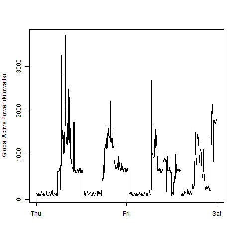

## Information

This is the output for assignment 1 from
 <a href="https://www.coursera.org/learn/exploratory-data-analysis">Exploratory Data Analysis</a>.
 
<b>Dataset</b>: <a href="https://d396qusza40orc.cloudfront.net/exdata%2Fdata%2Fhousehold_power_consumption.zip">Electric power consumption</a> [20Mb]

The 'household_power_consumption.txt' data file must be downloaded, unzipped and placed into a 'data' subfolder for these scripts to work.
 
 This includes the following self-contained R files (no dependencies):
* plot1.R
* plot2.R
* plot3.R
* plot4.R

You can simply source each file to generate the plots.

source("plot3.R")

### Plot 1

 

### Plot 2

 

### Plot 3

 

### Plot 4

 

